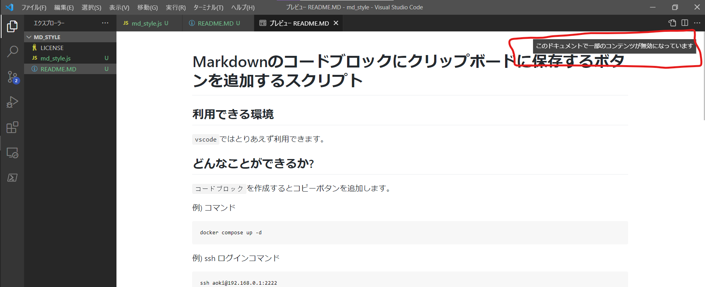
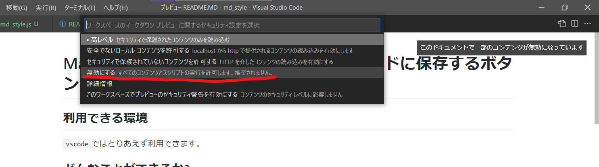

# Markdownのコードブロックにクリップボードに保存するボタンを追加するスクリプト

## 利用できる環境
`vscode`ではとりあえず利用できます。  
利用できないエディタもある場合がありますが、このスクリプトを追加しても画面は汚れません。

## どんなことができるか?

### テキストのコピーが簡単にできるようになります!!!

下のコードブロックにマウスを乗せてください。  
乗せるとCopyボタンが表示され、クリックするとクリップボードにコピーされます。
```
ssh aoki@192.168.0.1:2222 -k aoao -i /root/home/aoki/ao.key
```

コピペするとき、いちいち、選択して`Ctrl + C`でコピーする手間とストレスを削減することができます!!!  


## 使い方
1. スクリプトをmarkdownに張り付ける。
2. vscodeで開いたときにパーミッションを聞かれた場合は、すべて許可するを選択する。

### 1. スクリプトをmarkdownに張り付ける。
    
```
<script type="text/javascript">

    // preブロッグにコピー機能を付ける
    let pre_tags = document.getElementsByTagName("pre");
    let counter = 0;
    while (counter < pre_tags.length ) {
        console.log(pre_tags[counter]);
        
        let code_tag = pre_tags[counter].getElementsByTagName("code")[0];

        let tag_id = "code_"+counter;
        code_tag.setAttribute("id", tag_id);

        let copy_button = document.createElement('div');
        copy_button.innerText = "　"
        let button_id = "button_" + counter;
        copy_button.setAttribute("id", button_id);
        copy_button.setAttribute("style", "position: relative; left: 80%; top: 0px;\
            border: 0px;\
            font-weight: bold;\
            pading: 0px;\
            margin: 0px;\
            width: 80px;\
            background-color: transparent;\
            border: none;\
            cursor: pointer;\
            outline: none;\
            padding: 0;\
            appearance: none;")
        copy_button.setAttribute("onClick", "selectText(\""+ tag_id +"\", \"" + button_id +"\")");

        pre_tags[counter].insertBefore(copy_button, code_tag);

        pre_tags[counter].addEventListener('mouseover', ()  => {
                copy_button.innerText = "Copy"
            }, false);
        pre_tags[counter].addEventListener('mouseleave', () => {
                copy_button.innerText = "　"
            }, false);

        counter +=1;
    }
        
    function selectText(tag_id, button_id) {

        let elm = document.getElementById(button_id);
        elm.textContent = 'Copied!!';

        let selection = window.getSelection();
        selection.removeAllRanges();

        var element= document.getElementById(tag_id);
        var rng = document.createRange();
        rng.selectNodeContents(element);
        window.getSelection().addRange(rng);

        document.execCommand("copy");
    }
</script>
```
### 2. `vscode`で利用する際に、パーミッションを聞かれた際は、すべて許可にする。

vscodeでプレビューをすると以下のようなポップアップが表示されるので、ポップアップをクリックします。  


すると以下のような選択画面が表示されるので、`無効にする`を選択します。英語の場合は、`Disable`と表示されます。


以上の手順でコピーボタンを出現させることができます!!!


<!-- スタイルのjs -->
<script type="text/javascript" src="md_style.js"></script>